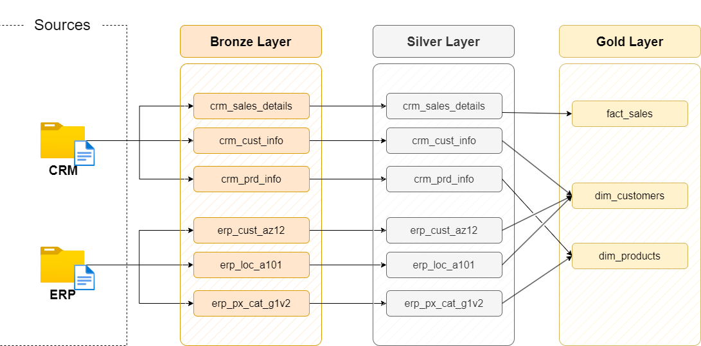
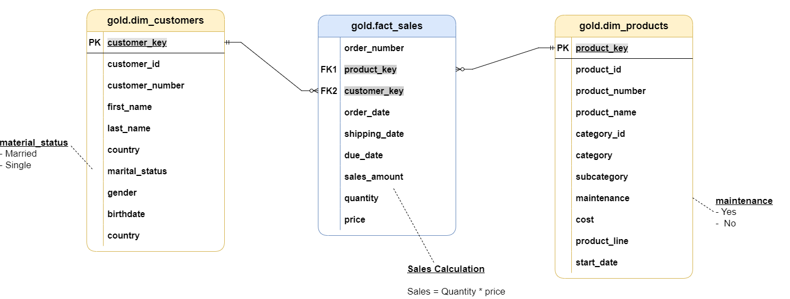

# 📊 **Data Warehouse Project**

## 📝 **Project Overview**

This project involves building a **Modern Data Warehouse** using the **Medallion Architecture** (Bronze, Silver, and Gold layers). The tasks include:

1. **Data Architecture**: Designing a Data Warehouse with **Bronze**, **Silver**, and **Gold** layers.
2. **ETL Pipelines**: Extracting, transforming, and loading data from source systems into the warehouse.
3. **Data Modeling**: Developing fact and dimension tables optimized for analytical queries.

---

## 🛠️ **Project Requirements**

### **Building the Data Warehouse (Data Engineering)**

#### 🎯 **Objective**
Develop a **Modern Data Warehouse** using PostgreSQL to consolidate sales data, enabling analytical reporting and informed decision-making.

#### 📝 **Specifications**
- **Data Sources**: Import data from two source systems (ERP and CRM) provided as CSV files.
- **Data Quality**: Cleanse and resolve data quality issues before analysis.
- **Integration**: Merge both datasets into a single, user-friendly data model designed for analytical queries.
- **Scope**: Focus only on the latest dataset; historization of data is not required.

---

## 🏗️ **Data Architecture**

The Data Warehouse design follows the **Medallion Architecture** with three main layers:

### 1. **Bronze Layer**
- Stores **raw** data exactly as it comes from the source systems (CSV files to PostgreSQL).

### 2. **Silver Layer**
- Data undergoes **cleaning**, **normalization**, and **standardization** to prepare it for analysis.

### 3. **Gold Layer**
- Stores **business-ready** data in a **star schema** format, optimized for reporting and analytics.

---

## **Data Catalog for Gold Layer**

### 1. **gold.dim_customers**
- **Purpose**: Stores customer details enriched with demographic and geographic data.

| Column Name       | Data Type    | Description                                                                                   |
|-------------------|--------------|-----------------------------------------------------------------------------------------------|
| `customer_key`    | INT          | Surrogate key uniquely identifying each customer in the dimension table.                       |
| `customer_id`     | INT          | Unique identifier for each customer.                                                          |
| `customer_number` | VARCHAR(50)  | Alphanumeric code used to track and reference the customer.                                   |
| `first_name`      | VARCHAR(50)  | Customer's first name.                                                                         |
| `last_name`       | VARCHAR(50)  | Customer's last name.                                                                          |
| `country`         | VARCHAR(50)  | Customer's country of residence.                                                              |
| `marital_status`  | VARCHAR(50)  | Customer's marital status (e.g., 'Married', 'Single').                                         |
| `gender`          | VARCHAR(50)  | Customer's gender (e.g., 'Male', 'Female').                                                   |
| `birthdate`       | DATE         | Customer's birthdate, formatted as YYYY-MM-DD (e.g., 1971-10-06).                             |
| `create_date`     | DATE         | Date and time when the customer record was created in the system.                             |

---

### 2. **gold.dim_products**
- **Purpose**: Provides information about the products and their attributes.

| Column Name         | Data Type     | Description                                                                                   |
|---------------------|---------------|-----------------------------------------------------------------------------------------------|
| `product_key`       | INT           | Surrogate key uniquely identifying each product in the product dimension table.               |
| `product_id`        | INT           | Unique identifier assigned to the product for tracking and referencing.                       |
| `product_number`    | VARCHAR(50)   | Structured alphanumeric code representing the product, often used for categorization or inventory. |
| `product_name`      | VARCHAR(50)   | Descriptive name of the product, including key details such as type, color, and size.         |
| `category_id`       | VARCHAR(50)   | Unique identifier for the product's category.                                                 |
| `category`          | VARCHAR(50)   | Broad classification of the product (e.g., Bikes, Components).                                |
| `subcategory`       | VARCHAR(50)   | More detailed classification of the product within the category (e.g., product type).         |
| `maintenance_required`| VARCHAR(50) | Indicates whether the product requires maintenance (e.g., 'Yes', 'No').                       |
| `cost`              | FLOAT         | Cost or base price of the product, in monetary units.                                          |
| `product_line`      | VARCHAR(50)   | The specific product line or series to which the product belongs (e.g., Road, Mountain).      |
| `start_date`        | DATE          | The date when the product became available for sale or use.                                   |

---

### 3. **gold.fact_sales**
- **Purpose**: Stores transactional sales data for analytical purposes.

| Column Name     | Data Type     | Description                                                                                   |
|-----------------|---------------|-----------------------------------------------------------------------------------------------|
| `order_number`  | VARCHAR(50)   | Unique alphanumeric identifier for each sales order (e.g., 'SO54496').                        |
| `product_key`   | INT           | Surrogate key linking the order to the product dimension table.                               |
| `customer_key`  | INT           | Surrogate key linking the order to the customer dimension table.                              |
| `order_date`    | DATE          | The date when the order was placed.                                                           |
| `shipping_date` | DATE          | The date when the order was shipped to the customer.                                          |
| `due_date`      | DATE          | The date when the order payment was due.                                                      |
| `sales_amount`  | INT           | Total monetary value of the sale for the line item, in whole currency units (e.g., 25).       |
| `quantity`      | INT           | Number of units of the product ordered for the line item (e.g., 1).                           |
| `price`         | INT           | Price per unit of the product for the line item, in whole currency units (e.g., 25).          |

---

## 🛡️ **License**

This project is licensed under the [MIT License](LICENSE). You are free to use, modify, and share this project with proper attribution.

---

## 🙋‍♂️ **About Me**

Hi, I'm **Alberto**, a passionate software developer with an insatiable thirst for knowledge and a knack for discovering innovative solutions. What truly sets me apart is my unyielding desire to learn and explore. I am constantly seeking opportunities to broaden my horizons, whether through attending industry conferences, participating in online courses, or collaborating with talented professionals. The ever-changing landscape of technology inspires me, and I eagerly embrace it with open arms.

Feel free to reach out to me to discuss potential collaborations, career opportunities, or simply to connect and share ideas. Together, let's embark on a journey of continuous learning and discovery!

